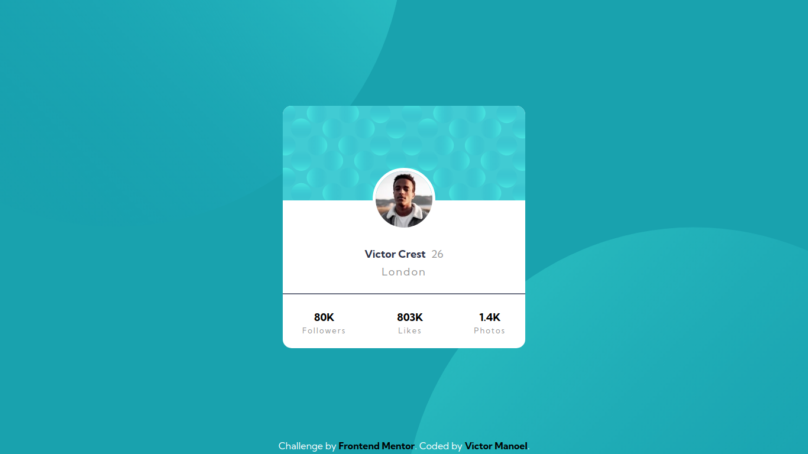

# Frontend Mentor - Profile card component solution

This is a solution to the [Profile card component challenge on Frontend Mentor](https://www.frontendmentor.io/challenges/profile-card-component-cfArpWshJ). Frontend Mentor challenges help you improve your coding skills by building realistic projects. 

## Table of contents

- [Overview](#overview)
  - [The challenge](#the-challenge)
  - [Screenshot](#screenshot)
  - [Links](#links)
- [My process](#my-process)
  - [Built with](#built-with)
- [Author](#author)
- 
## Overview

### The challenge

- Build out the project to the designs provided

### Screenshot

### Links

- Live Site URL: [Solution](https://victorgelado.github.io/FrontEndMentor/profile-card-component-main)

## My process

### Built with

- HTML
- CSS custom properties
- Flexbox

## Author

Made by **VictorGelado**

  
  
  <a href="mailto:victorgeladocontato@gmail.com" target="_blank">

